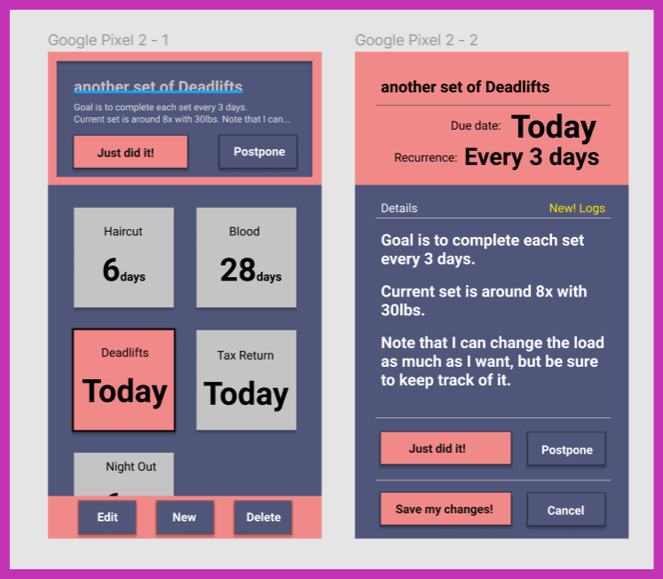

# Activity planner (not only Fitness tracker)

## TODO:

- add testing coverage(istambul, nyc)

## Summary:

- React app. `npm i` and `npm start` as usual.
- Tests with RTL and Jest.

## Resources

How to get me started with design:

- [Figma mock](https://www.figma.com/file/Y4GGkOtJrpoL9AirqWlZBv/Cards-and-activity-planner?node-id=0%3A1)

